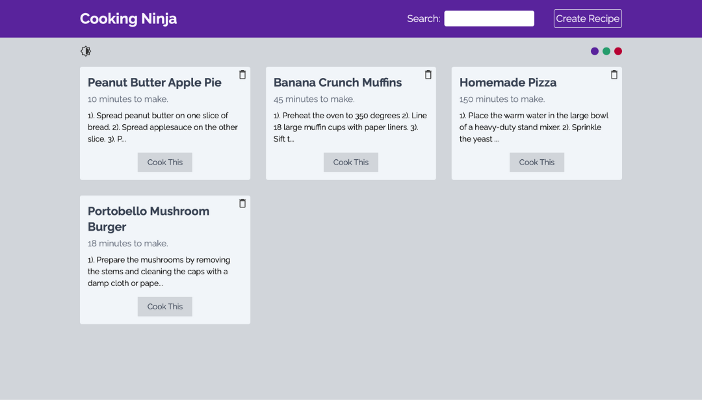
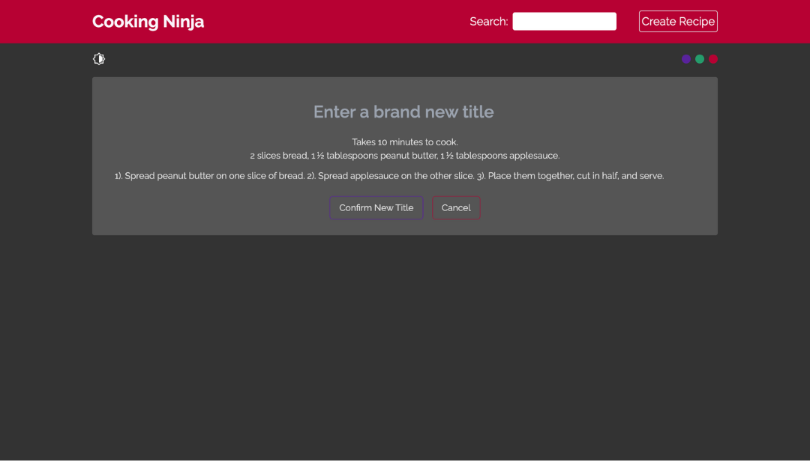

# Recipe App 

a cookbook application designed to allow users to create and organize their favorite recipes, step-by-step.

  

## General Info
This app creates an environment for food-lovers to find & store their recipes. The interface has a built-in light/dark-mode selector, in addition to a theme selector that allows users to change the colors. Recipes are stored in a Firestore Database, and users have the capability to change the title after it has been created. Currently tweaking the Search Bar functionality. 

## Technologies
Recipe was created with:
* React version: 17.0.2
* Firebase version: 8.5.0
* Tailwind version: 3.1.4

## Launch
The Dojo was deployed using firebase; simply click the following link: https://cooking-recipe-site-9315c.web.app/
